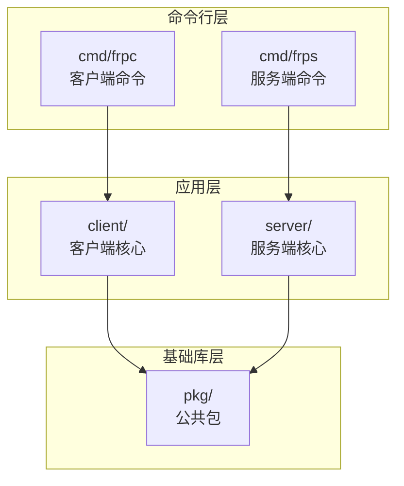

# FRP 项目模块依赖图

## 项目概述

FRP (Fast Reverse Proxy) 是一个高性能的反向代理应用，可以帮助将本地服务暴露到公网。项目采用 Go 语言编写，采用模块化设计，主要分为客户端 (frpc)、服务端 (frps) 和公共包 (pkg) 三大部分。

## 项目版本信息

- **Go 版本**: 1.24.0
- **项目模块**: github.com/purpose168/frp

## 模块结构总览

```
frp/
├── cmd/                    # 命令行入口
│   ├── frpc/              # 客户端命令
│   └── frps/              # 服务端命令
├── client/                 # 客户端核心模块
│   ├── api/               # 客户端API
│   ├── event/             # 事件处理
│   ├── health/            # 健康检查
│   ├── proxy/             # 代理实现
│   └── visitor/           # 访问者模式
├── server/                 # 服务端核心模块
│   ├── api/               # 服务端API
│   ├── controller/        # 控制器
│   ├── group/             # 分组管理
│   ├── metrics/           # 指标收集
│   ├── ports/             # 端口管理
│   ├── proxy/             # 代理实现
│   ├── registry/          # 注册表
│   └── visitor/           # 访问者模式
├── pkg/                    # 公共包
│   ├── auth/              # 认证模块
│   ├── config/            # 配置管理
│   ├── errors/            # 错误处理
│   ├── metrics/           # 指标定义
│   ├── msg/               # 消息协议
│   ├── nathole/           # NAT穿透
│   ├── plugin/            # 插件系统
│   ├── policy/            # 策略管理
│   ├── proto/             # 协议定义
│   ├── sdk/               # SDK
│   ├── ssh/               # SSH支持
│   ├── transport/         # 传输层
│   ├── util/              # 工具函数
│   ├── virtual/           # 虚拟化
│   └── vnet/              # 虚拟网络
├── conf/                   # 配置文件示例
├── doc/                    # 文档
├── dockerfiles/            # Docker配置
├── hack/                   # 开发脚本
├── assets/                 # 静态资源
├── web/                    # Web界面
│   ├── frpc/              # 客户端Web
│   └── frps/              # 服务端Web
└── test/                   # 测试代码
```

## 核心模块依赖关系图

### 顶层架构依赖图



### 详细模块依赖图

```mermaid
graph TB
    subgraph "命令行入口"
        cmd_frpc[cmd/frpc]
        cmd_frps[cmd/frps]
    end
    
    subgraph "客户端模块"
        client_api[client/api]
        client_event[client/event]
        client_health[client/health]
        client_proxy[client/proxy]
        client_visitor[client/visitor]
    end
    
    subgraph "服务端模块"
        server_api[server/api]
        server_control[server/control]
        server_controller[server/controller]
        server_group[server/group]
        server_metrics[server/metrics]
        server_ports[server/ports]
        server_proxy[server/proxy]
        server_registry[server/registry]
        server_visitor[server/visitor]
    end
    
    subgraph "公共包模块"
        pkg_auth[pkg/auth]
        pkg_config[pkg/config]
        pkg_errors[pkg/errors]
        pkg_metrics[pkg/metrics]
        pkg_msg[pkg/msg]
        pkg_nathole[pkg/nathole]
        pkg_plugin[pkg/plugin]
        pkg_policy[pkg/policy]
        pkg_proto[pkg/proto]
        pkg_sdk[pkg/sdk]
        pkg_ssh[pkg/ssh]
        pkg_transport[pkg/transport]
        pkg_util[pkg/util]
        pkg_virtual[pkg/virtual]
        pkg_vnet[pkg/vnet]
    end
    
    %% 命令行依赖
    cmd_frpc --> client_api
    cmd_frpc --> client_proxy
    cmd_frpc --> client_visitor
    cmd_frps --> server_api
    cmd_frps --> server_control
    
    %% 客户端内部依赖
    client_api --> client_event
    client_api --> client_health
    client_proxy --> client_event
    client_visitor --> client_event
    
    %% 服务端内部依赖
    server_api --> server_control
    server_api --> server_proxy
    server_api --> server_registry
    server_control --> server_controller
    server_control --> server_metrics
    server_control --> server_proxy
    server_control --> server_registry
    server_group --> server_proxy
    server_visitor --> server_registry
    
    %% 客户端对pkg的依赖
    client_api --> pkg_config
    client_api --> pkg_msg
    client_event --> pkg_msg
    client_health --> pkg_config
    client_proxy --> pkg_config
    client_proxy --> pkg_msg
    client_proxy --> pkg_transport
    client_visitor --> pkg_config
    client_visitor --> pkg_msg
    
    %% 服务端对pkg的依赖
    server_api --> pkg_config
    server_api --> pkg_metrics
    server_api --> pkg_util
    server_control --> pkg_auth
    server_control --> pkg_config
    server_control --> pkg_errors
    server_control --> pkg_msg
    server_control --> pkg_plugin
    server_control --> pkg_transport
    server_control --> pkg_util
    server_controller --> pkg_config
    server_metrics --> pkg_metrics
    server_ports --> pkg_config
    server_proxy --> pkg_config
    server_proxy --> pkg_msg
    server_proxy --> pkg_transport
    server_registry --> pkg_config
    server_visitor --> pkg_config
    server_visitor --> pkg_msg
    
    %% pkg内部依赖
    pkg_auth --> pkg_config
    pkg_config --> pkg_msg
    pkg_config --> pkg_util
    pkg_msg --> pkg_transport
    pkg_nathole --> pkg_msg
    pkg_nathole --> pkg_transport
    pkg_plugin --> pkg_config
    pkg_plugin --> pkg_msg
    pkg_sdk --> pkg_config
    pkg_transport --> pkg_util
    pkg_virtual --> pkg_config
    pkg_vnet --> pkg_config
```



## 主要模块说明

### 1. 命令行模块 (cmd/)

#### cmd/frpc - 客户端命令
- **职责**: 客户端命令行入口，解析命令行参数，启动客户端服务
- **依赖**: 
  - client/api
  - client/proxy
  - client/visitor
  - pkg/config
  - pkg/util

#### cmd/frps - 服务端命令
- **职责**: 服务端命令行入口，解析命令行参数，启动服务端服务
- **依赖**:
  - server/api
  - server/control
  - pkg/config
  - pkg/util

### 2. 客户端模块 (client/)

#### client/api - 客户端API
- **职责**: 提供客户端的HTTP API接口
- **依赖**:
  - client/event
  - client/health
  - pkg/config
  - pkg/msg
  - pkg/util

#### client/event - 事件处理
- **职责**: 处理客户端内部事件，如代理启动、关闭等
- **依赖**:
  - pkg/msg

#### client/health - 健康检查
- **职责**: 实现客户端健康检查机制
- **依赖**:
  - pkg/config
  - pkg/util

#### client/proxy - 代理实现
- **职责**: 实现各种代理类型（TCP、UDP、HTTP、HTTPS等）
- **依赖**:
  - client/event
  - pkg/config
  - pkg/msg
  - pkg/transport
  - pkg/util

#### client/visitor - 访问者模式
- **职责**: 实现访问者模式，用于STCP、XTCP等类型
- **依赖**:
  - client/event
  - pkg/config
  - pkg/msg
  - pkg/util

### 3. 服务端模块 (server/)

#### server/api - 服务端API
- **职责**: 提供服务端的HTTP API接口，包括仪表盘、代理管理等
- **依赖**:
  - server/control
  - server/proxy
  - server/registry
  - pkg/config
  - pkg/metrics
  - pkg/util

#### server/control - 控制连接
- **职责**: 管理客户端与服务端的控制连接，处理心跳、消息分发等
- **依赖**:
  - server/controller
  - server/metrics
  - server/proxy
  - server/registry
  - pkg/auth
  - pkg/config
  - pkg/errors
  - pkg/msg
  - pkg/plugin
  - pkg/transport
  - pkg/util

#### server/controller - 资源控制器
- **职责**: 管理服务端资源，如NAT穿透控制器等
- **依赖**:
  - pkg/config
  - pkg/nathole

#### server/group - 分组管理
- **职责**: 实现代理分组功能，支持负载均衡
- **依赖**:
  - server/proxy
  - pkg/config

#### server/metrics - 指标收集
- **职责**: 收集和统计服务端性能指标
- **依赖**:
  - pkg/metrics

#### server/ports - 端口管理
- **职责**: 管理服务端端口分配和释放
- **依赖**:
  - pkg/config

#### server/proxy - 代理实现
- **职责**: 实现服务端代理逻辑，处理用户连接
- **依赖**:
  - pkg/config
  - pkg/msg
  - pkg/transport
  - pkg/util

#### server/registry - 注册表
- **职责**: 维护客户端注册信息，支持客户端发现
- **依赖**:
  - pkg/config

#### server/visitor - 访问者模式
- **职责**: 实现服务端访问者模式
- **依赖**:
  - server/registry
  - pkg/config
  - pkg/msg

### 4. 公共包模块 (pkg/)

#### pkg/auth - 认证模块
- **职责**: 实现多种认证方式（token、OIDC等）
- **依赖**:
  - pkg/config
  - pkg/util

#### pkg/config - 配置管理
- **职责**: 配置文件解析、验证和管理
- **子模块**:
  - v1: 当前版本的配置结构
  - legacy: 旧版本配置兼容
- **依赖**:
  - pkg/msg
  - pkg/util

#### pkg/errors - 错误处理
- **职责**: 定义项目通用错误类型
- **依赖**: 无

#### pkg/metrics - 指标定义
- **职责**: 定义Prometheus指标
- **依赖**: 无

#### pkg/msg - 消息协议
- **职责**: 定义客户端与服务端之间的消息协议
- **依赖**:
  - pkg/transport

#### pkg/nathole - NAT穿透
- **职责**: 实现NAT穿透功能
- **依赖**:
  - pkg/msg
  - pkg/transport
  - pkg/util

#### pkg/plugin - 插件系统
- **职责**: 提供插件扩展机制
- **子模块**:
  - client: 客户端插件
  - server: 服务端插件
- **依赖**:
  - pkg/config
  - pkg/msg

#### pkg/policy - 策略管理
- **职责**: 实现访问策略控制
- **依赖**:
  - pkg/config

#### pkg/proto - 协议定义
- **职责**: 定义通信协议常量
- **依赖**: 无

#### pkg/sdk - SDK
- **职责**: 提供客户端SDK
- **依赖**:
  - pkg/config
  - pkg/msg

#### pkg/ssh - SSH支持
- **职责**: 提供SSH隧道功能
- **依赖**:
  - pkg/config

#### pkg/transport - 传输层
- **职责**: 实现传输层加密、压缩等功能
- **依赖**:
  - pkg/util

#### pkg/util - 工具函数
- **子模块**:
  - log: 日志记录
  - http: HTTP工具
  - net: 网络工具
  - version: 版本信息
  - wait: 等待工具
  - xlog: 扩展日志
- **依赖**: 无

#### pkg/virtual - 虚拟化
- **职责**: 实现虚拟化功能
- **依赖**:
  - pkg/config

#### pkg/vnet - 虚拟网络
- **职责**: 实现虚拟网络功能
- **依赖**:
  - pkg/config

## 外部依赖关系

### 核心外部依赖

| 依赖包 | 版本 | 用途 |
|--------|------|------|
| github.com/gorilla/mux | v1.8.1 | HTTP路由 |
| github.com/gorilla/websocket | v1.5.0 | WebSocket支持 |
| github.com/hashicorp/yamux | v0.1.1 | 多路复用 |
| github.com/quic-go/quic-go | v0.55.0 | QUIC协议 |
| github.com/spf13/cobra | v1.8.0 | 命令行框架 |
| github.com/prometheus/client_golang | v1.19.1 | Prometheus客户端 |
| golang.org/x/crypto | v0.41.0 | 加密库 |
| golang.org/x/net | v0.43.0 | 网络库 |

### 可选外部依赖

| 依赖包 | 版本 | 用途 |
|--------|------|------|
| github.com/xtaci/kcp-go/v5 | v5.6.13 | KCP协议 |
| github.com/songgao/water | latest | TUN/TAP设备 |
| github.com/vishvananda/netlink | v1.3.0 | 网络链接 |
| k8s.io/client-go | v0.28.8 | Kubernetes客户端 |

## 依赖关系分析

### 核心依赖链

1. **命令行 → 应用层 → 基础库**
   - cmd/frpc → client/* → pkg/*
   - cmd/frps → server/* → pkg/*

2. **配置管理依赖链**
   - pkg/config → pkg/msg → pkg/transport → pkg/util

3. **认证依赖链**
   - pkg/auth → pkg/config → pkg/util

4. **消息协议依赖链**
   - pkg/msg → pkg/transport → pkg/util

### 循环依赖检测

当前项目结构设计良好，未发现循环依赖问题。所有依赖关系都是单向的，遵循以下原则：

1. **上层依赖下层**: 命令行层依赖应用层，应用层依赖基础库层
2. **模块化设计**: 每个模块职责明确，依赖关系清晰
3. **接口隔离**: 通过接口定义模块边界，降低耦合度

### 高耦合模块识别

1. **server/control**: 依赖多个模块，是服务端核心控制模块
2. **pkg/config**: 被多个模块依赖，是配置管理核心
3. **pkg/msg**: 被多个模块依赖，是消息协议核心

## 模块职责矩阵

| 模块 | 配置管理 | 消息处理 | 网络通信 | 认证授权 | 指标监控 |
|------|----------|----------|----------|----------|----------|
| cmd/frpc | ✓ | | | | |
| cmd/frps | ✓ | | | | |
| client/api | ✓ | ✓ | ✓ | | |
| client/proxy | ✓ | ✓ | ✓ | | |
| server/api | ✓ | | ✓ | | ✓ |
| server/control | ✓ | ✓ | ✓ | ✓ | ✓ |
| pkg/config | ✓ | | | | |
| pkg/msg | | ✓ | | | |
| pkg/transport | | | ✓ | | |
| pkg/auth | | | | ✓ | |
| pkg/metrics | | | | | ✓ |

## 模块接口设计

### 客户端接口

```go
// client/api - 客户端API接口
type ClientAPI interface {
    Start() error
    Stop() error
    Reload() error
    Status() (*StatusResp, error)
}

// client/proxy - 代理接口
type Proxy interface {
    Run() error
    Close() error
    GetName() string
    GetConfigurer() ProxyConfigurer
}
```

### 服务端接口

```go
// server/api - 服务端API接口
type ServerAPI interface {
    GetServerInfo() (*ServerInfoResp, error)
    GetClientList() ([]ClientInfoResp, error)
    GetProxyList(proxyType string) (*GetProxyInfoResp, error)
}

// server/proxy - 代理接口
type Proxy interface {
    Run() (string, error)
    Close() error
    GetName() string
    GetConfigurer() ProxyConfigurer
    GetUsedPortsNum() int
}
```

### 公共接口

```go
// pkg/auth - 认证接口
type Verifier interface {
    VerifyLogin(*msg.Login) error
    VerifyPing(*msg.Ping) error
}

// pkg/transport - 传输接口
type MessageTransporter interface {
    Send(msg.Message) error
    Recv() (msg.Message, error)
}
```

## 模块演进建议

### 1. 解耦建议

1. **server/control模块**: 考虑将控制逻辑拆分为更小的子模块
2. **pkg/config模块**: 可以考虑将配置验证逻辑独立出来
3. **pkg/msg模块**: 可以将消息序列化/反序列化逻辑独立

### 2. 模块化改进

1. **引入依赖注入**: 降低模块间的直接依赖
2. **定义清晰接口**: 为每个模块定义对外接口
3. **模块边界明确**: 每个模块只负责单一职责

### 3. 测试覆盖

1. **单元测试**: 为每个模块编写单元测试
2. **集成测试**: 测试模块间的协作
3. **端到端测试**: 测试完整的业务流程

## 总结

FRP项目采用了清晰的分层架构设计，模块职责明确，依赖关系合理。主要特点包括：

1. **分层设计**: 命令行层、应用层、基础库层三层架构
2. **模块化**: 每个模块职责单一，便于维护和测试
3. **依赖清晰**: 所有依赖都是单向的，无循环依赖
4. **接口隔离**: 通过接口定义模块边界，降低耦合

这种设计使得项目易于理解、扩展和维护，是一个优秀的Go项目架构范例。
